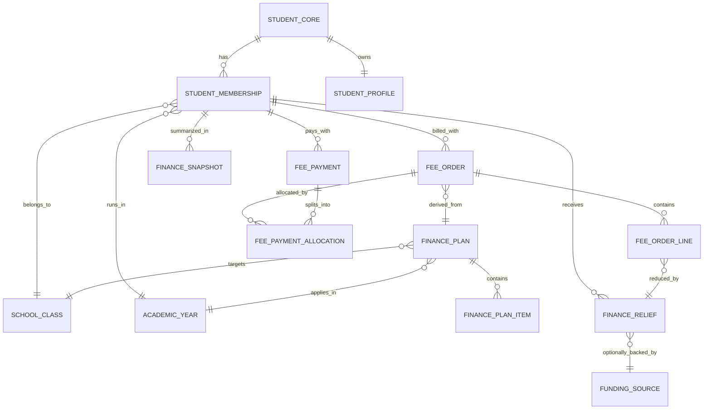

# نقشه تطبیق Finance Core V2

این سند برای تطبیق آسان‌تر بخش مالی فعلی پروژه با نسخه پیشنهادی مدرن تهیه شده است.
هدف این است که تیم بدون بازنویسی کامل، روی هسته موجود حرکت کند و مرحله‌به‌مرحله به یک سیستم مالی یکپارچه، حسابرسی‌پذیر و توسعه‌پذیر برسد.

## اسناد مکمل

- schema diff دقیق: `D:\School-Project\docs\FINANCE_CORE_V2_SCHEMA_DIFF_FA.md`
- backlog اجرایی: `D:\School-Project\docs\FINANCE_CORE_V2_EXECUTION_BACKLOG_FA.md`

## 1. خلاصه تصمیم معماری

پروژه فعلی همین حالا چند جزء مهم مالی را دارد:

- `FinanceFeePlan`
- `FinanceBill`
- `FinanceReceipt`
- `FeeOrder`
- `FeePayment`
- `Discount`
- `FeeExemption`
- `StudentMembership`

نتیجه بررسی این است:

- ساختار فعلی برای ارتقا مناسب است.
- نیاز به بازنویسی کامل نیست.
- بهترین مسیر، تکمیل لایه canonical فعلی است.

تصمیم پیشنهادی:

1. `FeeOrder` و `FeePayment` به هسته نهایی مالی تبدیل شوند.
2. `FinanceBill` و `FinanceReceipt` تا پایان migration فقط به عنوان لایه سازگاری نگه داشته شوند.
3. تخفیف، معافیت، بورسیه، خیریه و متعلم رایگان در یک موتور واحد relief ادغام شوند.
4. فیس‌های مختلف در سطح line item ذخیره شوند، نه فقط در سطح مبلغ نهایی.

---

## 2. ERD پیشنهادی نهایی

### توضیح موجودیت‌ها

- `FinancePlan`: تعرفه رسمی برای صنف، سال و نوع پلان
- `FinancePlanItem`: اجزای پلان مثل فیس ماهوار، داخله، ترانسپورت، امتحان
- `FeeOrder`: بدهی رسمی صادرشده برای یک عضویت
- `FeeOrderLine`: ردیف‌های داخل هر بدهی
- `FeePayment`: پرداخت واقعی
- `FeePaymentAllocation`: تخصیص پرداخت روی بدهی‌ها
- `FinanceRelief`: تخفیف/معافیت/بورسیه/خیریه/رایگان
- `FundingSource`: تمویل‌کننده یا خیریه
- `FinanceSnapshot`: نمای خلاصه برای داشبورد و performance

---

## 3. مدل نهایی پیشنهادی

## 3.1 FinancePlan

نسخه ارتقایافته `FinanceFeePlan`

فیلدهای پیشنهادی:

- `academicYearId`
- `classId`
- `planCode`
- `planType`
- `title`
- `currency`
- `billingFrequency`
- `isDefault`
- `priority`
- `effectiveFrom`
- `effectiveTo`
- `status`
- `eligibilityRule`
- `note`

### planType های پیشنهادی

- `standard`
- `charity`
- `sibling`
- `scholarship`
- `special`
- `semi_annual`

## 3.2 FinancePlanItem

فیلدهای پیشنهادی:

- `financePlanId`
- `feeType`
- `label`
- `amount`
- `isRecurring`
- `frequency`
- `dueDay`
- `status`

### feeType های پیشنهادی

- `tuition`
- `admission`
- `transport`
- `exam`
- `document`
- `service`
- `other`

## 3.3 FinanceRelief

مدل واحد برای همه امتیازات مالی

فیلدهای پیشنهادی:

- `studentMembershipId`
- `reliefType`
- `coverageMode`
- `valueType`
- `value`
- `percentage`
- `feeScope`
- `sponsorId`
- `reason`
- `approvalPolicy`
- `approvedBy`
- `effectiveFrom`
- `effectiveTo`
- `status`
- `cancelReason`
- `createdBy`

### reliefType های پیشنهادی

- `discount`
- `exemption`
- `scholarship_partial`
- `scholarship_full`
- `charity_support`
- `free_student`
- `manual_adjustment`

## 3.4 FundingSource

فیلدهای پیشنهادی:

- `name`
- `sourceType`
- `contactName`
- `phone`
- `email`
- `referenceCode`
- `status`
- `note`

### sourceType های پیشنهادی

- `charity`
- `sponsor`
- `foundation`
- `school_support`
- `government`
- `other`

## 3.5 FeeOrder

هسته اصلی بدهی

فیلدهای پیشنهادی:

- `studentMembershipId`
- `financePlanId`
- `orderNumber`
- `orderType`
- `billingCycle`
- `periodType`
- `periodLabel`
- `issuedAt`
- `dueDate`
- `currency`
- `amountOriginal`
- `amountRelief`
- `amountPenalty`
- `amountDue`
- `amountPaid`
- `outstandingAmount`
- `status`
- `source`
- `createdBy`
- `voidReason`
- `voidedBy`
- `voidedAt`

## 3.6 FeeOrderLine

فیلدهای پیشنهادی:

- `feeOrderId`
- `feeType`
- `title`
- `amountOriginal`
- `reliefAmount`
- `netAmount`
- `meta`

## 3.7 FeePayment

فیلدهای پیشنهادی:

- `studentMembershipId`
- `paymentNumber`
- `payerType`
- `receivedBy`
- `amount`
- `currency`
- `paymentMethod`
- `allocationMode`
- `referenceNo`
- `paidAt`
- `status`
- `approvalStage`
- `approvalTrail`
- `followUp`
- `note`

## 3.8 FeePaymentAllocation

فیلدهای پیشنهادی:

- `feePaymentId`
- `feeOrderId`
- `feeOrderLineId`
- `amount`
- `appliedAt`

## 3.9 FinanceSnapshot

اختیاری ولی مفید برای داشبورد

فیلدهای پیشنهادی:

- `studentMembershipId`
- `academicYearId`
- `totalBilled`
- `totalPaid`
- `totalOutstanding`
- `lastPaymentAt`
- `lastOrderAt`
- `financeStatus`
- `updatedAt`

---

## 4. Mapping از ساختار فعلی به ساختار نهایی

| ساختار فعلی | نقش فعلی | ساختار نهایی | تصمیم |
|---|---|---|---|
| `StudentMembership` | هویت مالی اصلی | `StudentMembership` | بدون تغییر اساسی |
| `FinanceFeePlan` | تعرفه فیس صنف | `FinancePlan` + `FinancePlanItem` | توسعه |
| `FinanceBill` | بدهی قدیمی | `FeeOrder` | بازنشستگی تدریجی |
| `FinanceReceipt` | رسید قدیمی | `FeePayment` | بازنشستگی تدریجی |
| `FeeOrder` | بدهی canonical | `FeeOrder` + `FeeOrderLine` | نگه‌داری و توسعه |
| `FeePayment` | پرداخت canonical | `FeePayment` + `FeePaymentAllocation` | نگه‌داری و توسعه |
| `Discount` | تخفیف ساده | `FinanceRelief` | ادغام |
| `FeeExemption` | معافیت | `FinanceRelief` | ادغام |
| `TransportFee` | هزینه ترانسپورت مستقل | یا `FinancePlanItem` یا `FeeOrderLine` | جذب در هسته |
| `StudentProfile` | اطلاعات خانواده و تماس | `StudentProfile` | استفاده برای جستجوی مالی |

---

## 5. Gap Analysis نسبت به دیتابیس فعلی

## 5.1 موردهای آماده

این بخش‌ها همین حالا پایه مناسب دارند:

- عضویت‌محور بودن مالی
- بدهی و پرداخت canonical
- تخصیص پرداخت روی چند بدهی
- approval trail چندمرحله‌ای
- follow-up
- گزارش پایه
- month close

## 5.2 موردهای ناقص

### A. چند پلان مالی برای یک صنف

مشکل فعلی:

- `FinanceFeePlan` با indexهای unique فعلی بیشتر به یک پلان برای هر ترکیب صنف/سال/فریکونسی تمایل دارد.

نیاز نهایی:

- چند پلان فعال یا قابل انتخاب برای یک صنف
- انتخاب پلان پیش‌فرض
- اولویت و بازه اعتبار

### B. نبود line item در بدهی

مشکل فعلی:

- preview بل `feeBreakdown` می‌سازد اما bill/order نهایی line item رسمی ندارد.

اثر:

- گزارش دقیق به تفکیک نوع فیس ضعیف می‌شود
- audit روی سهم ترانسپورت/امتحان/داخله دقیق نیست

### C. مدل relief هنوز رسمی نیست

مشکل فعلی:

- `Discount` و `FeeExemption` دو مدل جدا هستند
- sponsor و بازه زمانی و policy رسمی ندارند

اثر:

- متعلم رایگان
- بورسیه جزئی
- حمایت خیریه
- خواهر/برادر

همه به صورت کامل و استاندارد پوشش داده نمی‌شوند.

### D. همزیستی bill/receipt قدیمی با order/payment canonical

این ساختار برای migration مفید است، اما اگر ادامه پیدا کند:

- منطق business دو لایه می‌شود
- گزارش‌ها پیچیده می‌شوند
- احتمال divergence بالا می‌رود

---

## 6. Migration Map عملی

## فاز 0: تثبیت هسته فعلی

هدف:

- canonical layer را رسمی کنیم

کارها:

1. همه endpointهای جدید روی `FeeOrder` و `FeePayment` متمرکز شوند.
2. `FinanceBill` و `FinanceReceipt` فقط compatibility layer باشند.
3. هر create/update حساس فقط از یک مسیر انجام شود.

خروجی:

- هسته واحد business logic

## فاز 1: ارتقای FeePlan

کارها:

1. افزودن `planCode`
2. افزودن `planType`
3. افزودن `priority`
4. افزودن `effectiveFrom`
5. افزودن `effectiveTo`
6. افزودن `isDefault`
7. شکستن breakdownها به `FinancePlanItem`

خروجی:

- چند پلان برای یک صنف و یک سال ممکن می‌شود

## فاز 2: رسمی‌سازی Relief Engine

کارها:

1. ساخت `FinanceRelief`
2. migration داده‌های `Discount`
3. migration داده‌های `FeeExemption`
4. تعریف `reliefType`
5. افزودن `effectiveFrom/effectiveTo`
6. افزودن `sponsorId`

خروجی:

- تخفیف، معافیت، بورسیه، رایگان و خیریه یکجا مدیریت می‌شوند

## فاز 3: افزودن FeeOrderLine

کارها:

1. ساخت collection یا subdocument برای `FeeOrderLine`
2. ذخیره line item در زمان preview/generate bill
3. اعمال relief روی line item
4. پشتیبانی allocation جزئی روی line item در آینده

خروجی:

- گزارش‌پذیری دقیق‌تر
- حسابرسی بهتر

## فاز 4: Finance Snapshot

کارها:

1. ساخت `FinanceSnapshot`
2. به‌روزرسانی snapshot بعد از order/payment/relief
3. استفاده در dashboard

خروجی:

- dashboard سریع
- جستجوی مالی سریع

## فاز 5: بازنشستگی لایه قدیمی

کارها:

1. freeze کردن create/update روی `FinanceBill`
2. freeze کردن create/update روی `FinanceReceipt`
3. نگه‌داری read-only برای archive
4. انتقال UIها به canonical layer

خروجی:

- معماری ساده‌تر و پایدارتر

---

## 7. ترتیب migration دیتابیس

ترتیب امن migration:

1. افزودن fieldهای جدید بدون حذف fieldهای قدیمی
2. backfill داده‌ها
3. سوییچ read path
4. سوییچ write path
5. archive path قدیمی
6. حذف نهایی field/collectionهای deprecated

### اصل مهم

تا قبل از پایان backfill:

- چیزی حذف نشود
- indexهای قدیمی یکباره برداشته نشود
- sync bridge غیرفعال نشود

---

## 8. Migration دقیق هر مدل

## 8.1 FinanceFeePlan -> FinancePlan + FinancePlanItem

### داده فعلی

- `tuitionFee`
- `admissionFee`
- `examFee`
- `documentFee`
- `transportDefaultFee`
- `otherFee`

### تبدیل

- هر سند `FinanceFeePlan` یک `FinancePlan`
- هر مبلغ غیرصفر یک `FinancePlanItem`

### مثال

اگر یک پلان این مقادیر را داشته باشد:

- tuition = 1200
- admission = 500
- exam = 200

نتیجه:

- 1 رکورد `FinancePlan`
- 3 رکورد `FinancePlanItem`

## 8.2 Discount + FeeExemption -> FinanceRelief

### Discount

- `discountType` -> `reliefType`
- `amount` -> `value`
- `reason` -> `reason`
- `status` -> `status`

### FeeExemption

- `exemptionType=full` -> `reliefType=free_student` یا `exemption`
- `scope` -> `feeScope`
- `amount/percentage` -> `value/percentage`
- `approvedBy` -> `approvedBy`

## 8.3 FinanceBill -> FeeOrder

اگر `FeeOrder` canonical همین حالا از `FinanceBill` sync می‌شود، migration منطقی این است:

- `FinanceBill` دیگر master نباشد
- `FeeOrder` master شود

### فیلدهای قابل نگه‌داری

- `billNumber` -> `orderNumber`
- `periodType`
- `periodLabel`
- `amountOriginal`
- `amountDue`
- `amountPaid`
- `issuedAt`
- `dueDate`
- `status`

### فیلدهای لازم برای توسعه

- `financePlanId`
- `amountRelief`
- `amountPenalty`
- `lineItems`

## 8.4 FinanceReceipt -> FeePayment

### تبدیل

- `FinanceReceipt` فقط legacy receipt باقی بماند
- تمام UIهای جدید روی `FeePayment` نوشته شوند

### نگه‌داری

- file upload
- referenceNo
- approvalTrail
- followUp

---

## 9. Index Strategy پیشنهادی

## 9.1 FinancePlan

indexهای پیشنهادی:

- `(classId, academicYearId, status)`
- `(classId, academicYearId, planType, isDefault)`
- `(classId, academicYearId, effectiveFrom, effectiveTo)`

### نکته مهم

index unique فعلی باید بعد از migration بازبینی شود، چون برای چند پلان هم‌زمان محدودکننده است.

## 9.2 FinanceRelief

- `(studentMembershipId, status, reliefType)`
- `(academicYearId, classId, status)`
- `(sponsorId, status)`
- `(effectiveFrom, effectiveTo, status)`

## 9.3 FeeOrder

- `(studentMembershipId, status, dueDate)`
- `(classId, academicYearId, status)`
- `(orderNumber)` unique
- `(periodType, periodLabel, academicYearId)`

## 9.4 FeePayment

- `(studentMembershipId, status, paidAt)`
- `(receivedBy, paidAt, status)`
- `(referenceNo)` sparse unique when needed
- `(approvalStage, status)`

---

## 10. Rule Engine پیشنهادی

برای ساده شدن business logic، ترتیب محاسبه این باشد:

1. پلان پایه انتخاب شود
2. line itemها ساخته شوند
3. reliefهای فعال استخراج شوند
4. relief روی scopeهای مجاز اعمال شود
5. penalty اضافه شود
6. amountDue نهایی ساخته شود
7. order ایجاد شود

فرمول:

`Net Due = Sum(Line Items) - Sum(Reliefs) + Sum(Penalties)`

---

## 11. UX Mapping برای تطبیق آسان

## 11.1 منوی پیشنهادی نهایی

### داشبورد مالی

- summary
- cashflow
- top debtors
- approval queue

### پلان و تعرفه

- finance plans
- plan items
- pricing variants

### بدهی و بل

- bill preview
- bill generate
- open orders
- overdue orders

### پرداخت

- payment desk
- receipt review
- cashier report

### تخفیف و معافیت

- relief registry
- free students
- sponsor support

### گزارش‌ها

- finance overview
- debtors
- discount and exemption overview
- by class
- export

---

## 12. پیشنهاد نهایی برای پیاده‌سازی

اگر بخواهیم هم مدرن باشد و هم تطبیق آن آسان بماند، بهترین نسخه این است:

### تصمیم نهایی

- `StudentMembership` = محور هویت مالی
- `FinancePlan` = منبع تعرفه
- `FeeOrder` = منبع بدهی
- `FeePayment` = منبع پرداخت
- `FinanceRelief` = منبع همه امتیازات مالی
- `FinanceSnapshot` = منبع dashboard

### چیزی که نباید انجام شود

- افزودن صفحه‌های پراکنده جدید بدون یکپارچه‌سازی مدل
- نگه‌داشتن طولانی‌مدت دو business flow جدا
- ثبت breakdown فقط در UI preview و نه در دیتابیس

### چیزی که باید انجام شود

1. canonical-first architecture
2. line-item billing
3. unified relief engine
4. plan variants
5. migration step-by-step

---

## 13. چک‌لیست اجرایی کوتاه

### نسخه 1

- [ ] `FinancePlan` را variant-ready کن
- [ ] `FinanceRelief` را بساز
- [ ] APIهای relief را یکپارچه کن

### نسخه 2

- [ ] `FeeOrderLine` را اضافه کن
- [ ] bill preview را line-item aware کن
- [ ] reportها را به line item وصل کن

### نسخه 3

- [ ] snapshot بساز
- [ ] جستجوی مالی را به phone/guardian/father وصل کن
- [ ] free student و sponsor dashboard را اضافه کن

### نسخه 4

- [ ] write path قدیمی را ببند
- [ ] legacy layer را archive کن

---

## 14. نتیجه

این پروژه برای یک بخش مالی حرفه‌ای کاملاً قابل ارتقا است.
بهترین راه، بازطراحی از صفر نیست؛ بهترین راه، تکمیل هسته موجود با این چهار محور است:

- `Plan Variants`
- `Unified Relief`
- `Line-item Orders`
- `Canonical-first Migration`

اگر این چهار محور اجرا شوند، بخش مالی از حالت چند صفحه‌ای به یک سیستم واقعی مالی مکتب تبدیل می‌شود.
